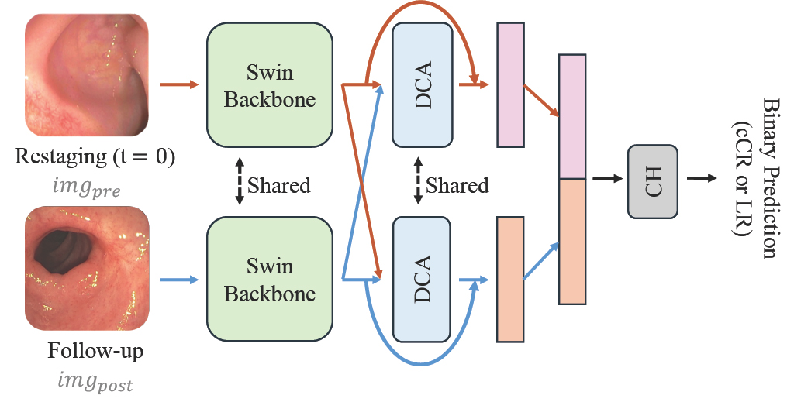

<div align="center">

# SSDCA

</div>

### Dual Cross-Attention Siamese Transformer for Rectal Tumor Regrowth Assessment in Watch-and-Wait Endoscopy

[](https://ieeexplore.ieee.org/abstract/document/11515991)
[](https://mskcc.box.com/s/cxwthbnb4jnqh2cz5d7wzbbeepgaxpz2)


Patients with locally advanced rectal cancer (LARC) who achieve a clinical complete response (cCR) after total neoadjuvant therapy (TNT) are increasingly managed under a Watch-and-Wait (WW) protocol to avoid surgery. However, ~25–30% of these patients experience local regrowth, making early and accurate prediction critical. We propose **SSDCA**, a Siamese Swin Transformer with a Dual Cross-Attention module that jointly reasons over paired longitudinal endoscopy images (restaging + follow-up) to classify cCR vs. local regrowth.

## Architecture



A pair of longitudinal images (restaging and follow-up) are independently processed by a shared Swin Transformer encoder. Stage 4 features from both images are passed through a shared Dual Cross-Attention (DCA) module, which attends to semantically relevant features in one image at the spatial locations of the other, producing attention-refined residuals. These are pooled, concatenated, and classified as cCR or local regrowth.

## Installation

```bash
pip install torch torchvision timm tensorboard scikit-learn pandas numpy matplotlib openpyxl tqdm pillow
```

A CUDA-capable GPU is recommended for training.

## Repository Structure

```
SSDCA/
├── models/
│   ├── SSDCA.py               # Siamese Swin + Dual Cross-Attention model
│   └── SiameseSwin_Small.py   # Siamese Swin baseline
├── main.py                    # Training entry point
├── train.py                   # Training and evaluation loops
├── load_dataset.py            # Dataset and dataloader definitions
├── test.py                    # Inference and metrics
├── gradCams.py                # GradCAM visualization
├── utils.py                   # Utilities (seed, model factory)
├── data/                      # Example JSON files (see Data Format)
└── Example.sh                 # Example training command
```

## Data Format

Two JSON files are required in your dataset directory:

**`image_combinations.json`** — maps patient IDs to lists of image pair combinations:
```json
{
    "patient_001": [
        [
            {"name": "patient_001/restaging.jpg", "label": 0},
            {"name": "patient_001/followup.jpg",  "label": 0}
        ]
    ]
}
```
Labels: `0` = cCR, `1` = local regrowth. Image paths are relative to `--data_dir`.

**`fold_N.json`** — defines the cross-validation split:
```json
{
    "train": ["patient_001", "patient_002"],
    "val":   ["patient_003"],
    "test":  ["patient_004"]
}
```

See [`data/`](data/) for example files.

## Training

[`Example.sh`](Example.sh) shows how to launch a training run via [`main.py`](main.py):

```bash
python main.py --num_classes 2 \
--model_config SSDCA \
--num_epochs 30 \
--batch_size 8 \
--learning_rate 2e-5 \
--data_dir /path/to/your/dataset \
--json_fold /path/to/your/dataset/fold_2.json \
--sampler balanced \
--save_dir "checkpoints" \
--model_naming SSDCA_Fold2 \
--seed 115
```

| Argument | Description |
|---|---|
| `--data_dir` | Root directory containing images and `image_combinations.json` |
| `--model_config` | Architecture: `Swin_S` (single-image), `SSFC` (Siamese baseline), `SSDCA` (ours) |
| `--json_fold` | Path to fold JSON defining train/val/test split |
| `--sampler balanced` | Enables weighted sampling to handle class imbalance |
| `--save_dir` / `--model_naming` | Output directory for checkpoints, logs, and TensorBoard |
| `--seed` | Random seed for reproducibility |

Checkpoints, logs, and TensorBoard summaries are written to `<save_dir>/<model_naming>`.

## Pretrained Weights

Pretrained weights for the three models (SSDCA, SSFC, and SwinS-SingleImage) are available on [Box](https://mskcc.box.com/s/cxwthbnb4jnqh2cz5d7wzbbeepgaxpz2). The link contains a folder per model, each with 5 folds, and every fold folder contains a `final_model.pt` checkpoint.

## Citation

If you use this code, please cite:

```bibtex
@inproceedings{gomez2026dual,
  title={Dual Cross-Attention Siamese Transformer for Rectal Tumor Regrowth Assessment in Watch-and-Wait Endoscopy},
  author={Gomez, Jorge Tapias and Kanata, Despoina and Rangnekar, Aneesh and Lee, Christina and Smith, J Joshua and Garcia-Aguilar, Julio and Veeraraghavan, Harini},
  booktitle={2026 IEEE 23rd International Symposium on Biomedical Imaging (ISBI)},
  pages={1--5},
  year={2026},
  organization={IEEE}
}
```
